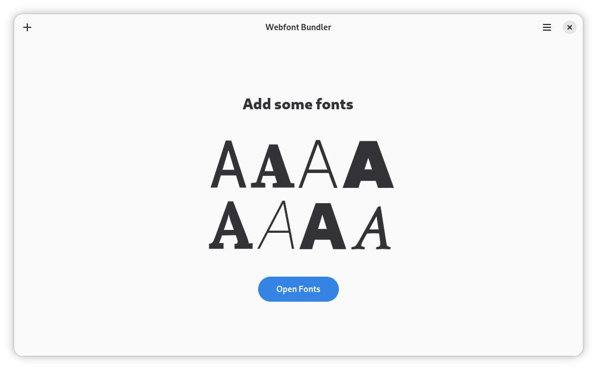
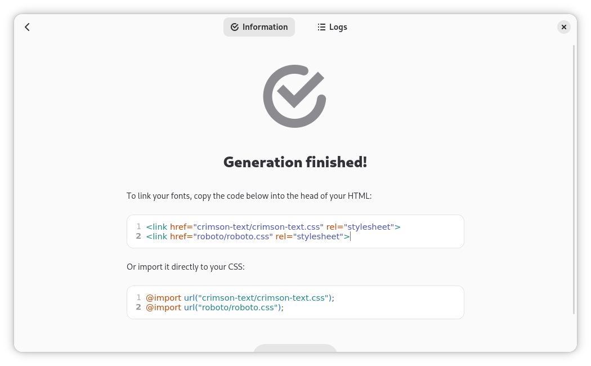

 

# Webfont Kit Generator

Create @font-face kits easily

<br/>

[](https://stopthemingmy.app) 
[](https://circle.gnome.org/)

[](https://github.com/rafaelmardojai/WebfontKitGenerator/blob/master/COPYING)
[](https://paypal.me/RafaelMardojaiCM)
[](https://liberapay.com/rafaelmardojai/donate)


## Description
**Webfont Kit Generator** is a simple utility that allows you to generate **woff**, **woff2** and the necessary CSS boilerplate from non-web font formats (otf & ttf).

Webfont Kit Generator also includes a tool to Download fonts from Google Fonts for self-hosting.

Webfont Kit Generator uses [fontTools](https://github.com/fonttools/fonttools) python library under the hood.

## Install
<a href="https://flathub.org/apps/details/com.rafaelmardojai.WebfontKitGenerator"></a>

### Third Party Packages

| Distribution | Package | Maintainer |
|:-:|:-:|:-:|
| Ubuntu (PPA) | [`Stable Releases`](https://launchpad.net/~apandada1/+archive/ubuntu/webfontkitgenerator), [`Daily Builds`](https://launchpad.net/~apandada1/+archive/ubuntu/webfontkitgenerator-daily) | [Archisman Panigrahi](https://github.com/apandada1) |
| Arch Linux (AUR) | [`webfontkitgenerator-git`](https://aur.archlinux.org/packages/webfontkitgenerator-git/) | [Archisman Panigrahi](https://github.com/apandada1) |
| Fedora Linux (Copr) | [`webfont-kit-generator`](https://copr.fedorainfracloud.org/coprs/xfgusta/webfont-kit-generator/) | [Gustavo Costa](https://github.com/xfgusta)|

## Building

### Requirements

- Python 3 `python`
- PyGObject `python-gobject`
- GTK4 (>= 4.12.0) `gtk4`
- libadwaita (>= 1.4.0) `libadwaita`
- libsoup (>= 3.0) `libsoup3`
- gtksourceview (>= 5.0) `gtksourceview5`
- Meson `meson`
- Ninja `ninja`
- fontTools `python-fontTools`
- brotli `python-brotli`

Clone and run from GNOME Builder.
Alternatively, you can build with `meson`.
```bash
meson builddir --prefix=/usr/local
sudo ninja -C builddir install
```

### Collect Python deps for flatpak

```bash
build-aux/flatpak-pip-generator  --requirements-file requirements.txt --output=build-aux/python3-requirements
```

## Screenshots

<p align="center">
  
  
  
  
  
</p>

## Translations
Webfont Kit Generator is translated into several languages. If your language is missing or incomplete, please help to [translate Webfont Kit Generator in Transifex](https://www.transifex.com/rafaelmardojai/webfont-kit-generator/).

## Credits
Developed by **[Rafael Mardojai CM](https://github.com/rafaelmardojai)** and [contributors](https://github.com/rafaelmardojai/WebfontKitGenerator/graphs/contributors).

## Donate
If you want to support my work, you can donate me, [here you can find how](https://rafaelmardojai.com/donate/).
