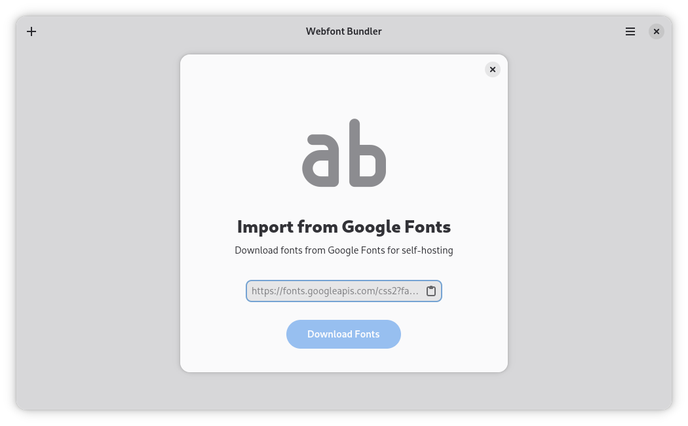
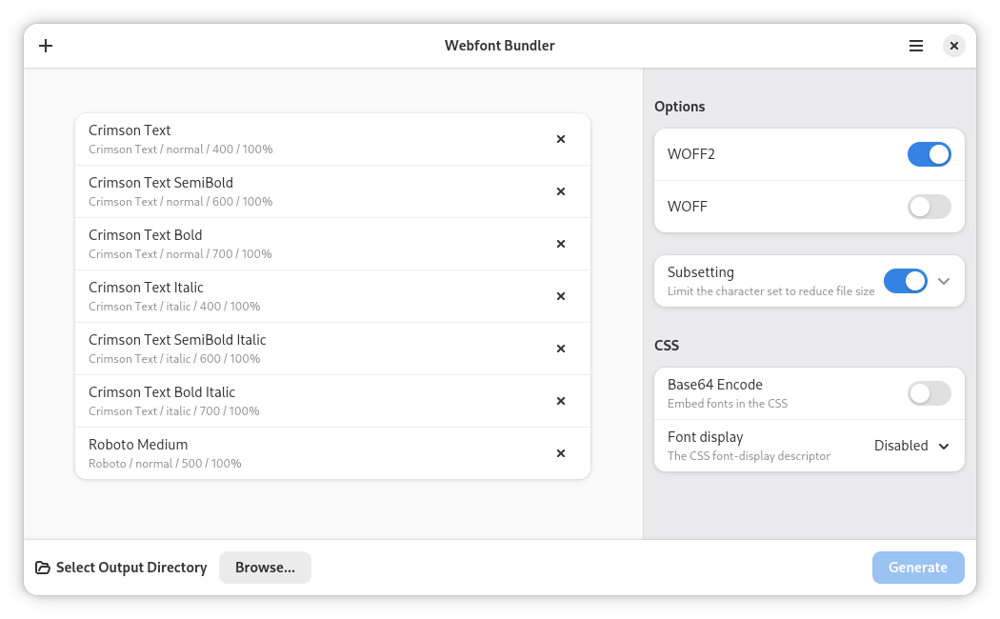

<h1 align="center">
	 
	Webfont Kit Generator
</h1>

 

<strong>Create @font-face kits easily</strong>

## Description
**Webfont Kit Generator** is a simple utility that allows you to generate **woff**, **woff2** and the necessary CSS boilerplate from non-web font formats (otf & ttf).

Webfont Kit Generator uses [fontTools](https://github.com/fonttools/fonttools) python library under the hood.

## Installation
Available soon in Flathub.

## Building
Clone and run from GNOME Builder.

## Screenshots

  
  
  
  

## Credits
Developed by **[Rafael Mardojai CM](https://github.com/rafaelmardojai)** and [contributors](https://github.com/rafaelmardojai/WebfontKitGenerator/graphs/contributors).

## Donate
If you want to support development, consider donating via [PayPal](https://paypal.me/RafaelMardojaiCM).
